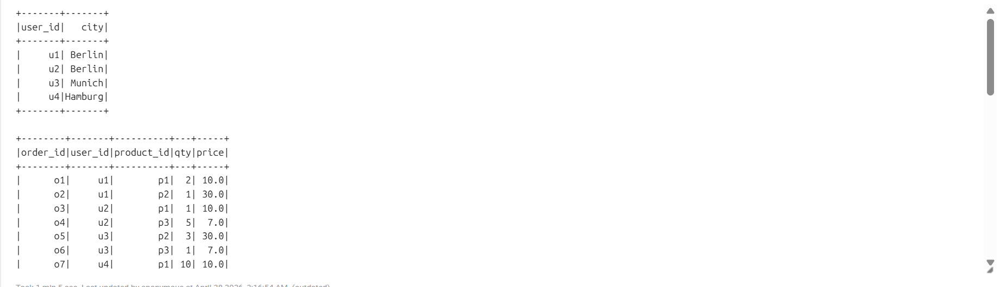
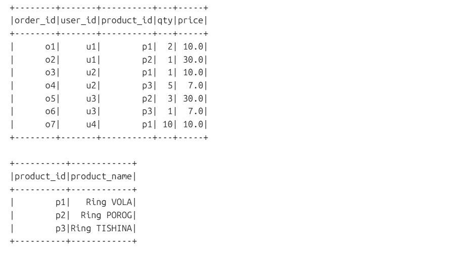
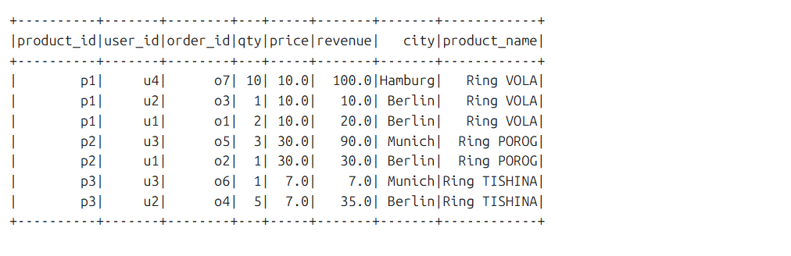
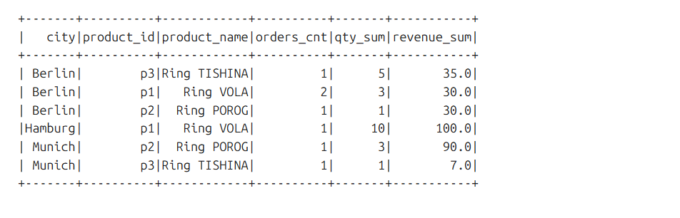
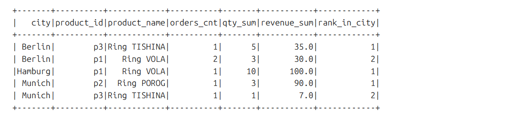
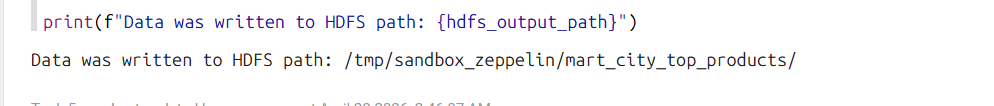
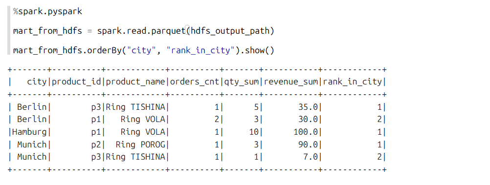
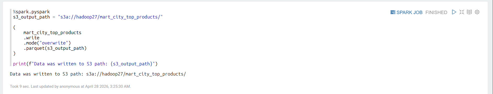
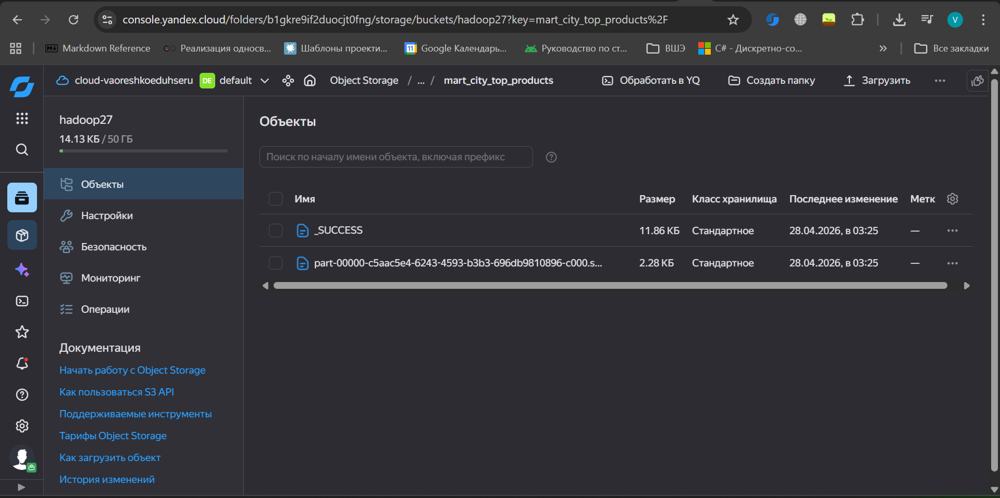
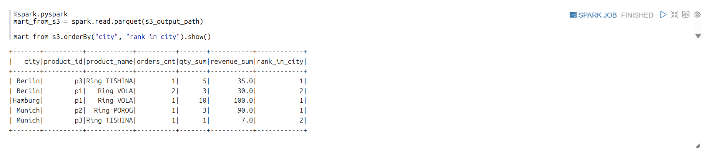

# 📊 HW1 Mart: City Top Products (PySpark)

👨‍🎓 Выполнил: **Орешко Владислав**

## 📌 Описание проекта

В рамках задания реализован pipeline обработки данных с использованием PySpark:

* объединение данных (users, orders, products)
* расчёт выручки
* агрегация по городам и продуктам
* определение топ-2 продуктов в каждом городе
* сохранение результатов в HDFS и S3

---

## 🧱 Архитектура

Pipeline:

1. Source Data (DataFrames)
2. Join
3. Feature Engineering (revenue)
4. Aggregation
5. Window Function (ranking)
6. Storage:

   * HDFS
   * S3 (Object Storage)

---

## 📂 Исходные данные

### Users



### Orders


### Products



---

## 🔗 Join данных

Объединение orders + users + products:



---

## 📊 Агрегация

Расчёт:

* количество заказов
* суммарное количество товаров
* выручка



---

## 🏆 Топ продуктов по городам

Используется оконная функция:

```python
Window.partitionBy("city").orderBy(F.desc("revenue_sum"))
```

Результат:



---

## 💾 Запись в HDFS

Данные успешно записаны:





---

## ☁️ Запись в S3

Данные записаны в Object Storage:

```
s3a://hadoop27/mart_city_top_products/
```







---

## 🛠 Используемые технологии

* PySpark
* Apache Zeppelin
* HDFS
* S3 (Yandex Object Storage)
* DataProc

---

## ✅ Итог

Реализован end-to-end pipeline:

* обработка данных
* агрегация
* хранение в Data Lake (S3)

---

## ✅ Соответствие требованиям задания

В рамках работы были выполнены все пункты задания:

1. **Расчёт выручки**
   - Добавлено поле `revenue = qty * price`

2. **Объединение данных**
   - Выполнен join таблиц:
     - `orders`
     - `users`
     - `products`

3. **Агрегация по (city, product_id, product_name)**
   Рассчитаны метрики:
   - `orders_cnt` — количество заказов
   - `qty_sum` — суммарное количество товаров
   - `revenue_sum` — суммарная выручка

4. **Определение Top-2 товаров по городам**
   - Использована оконная функция:
   ```python
   Window.partitionBy("city").orderBy(F.desc("revenue_sum"))
   ```

5. **Сохранение результатов**
   - В HDFS:
     ```
     /tmp/sandbox_zeppelin/mart_city_top_products/
     ```
   - В S3:
     ```
     s3a://hadoop27/mart_city_top_products/
     ```
   - Формат: `parquet`
   - Режим: `overwrite`

6. **Проверка результата**
   - Данные успешно прочитаны из:
     - HDFS
     - S3
   - Выполнен вывод финального результата (`show()`)
